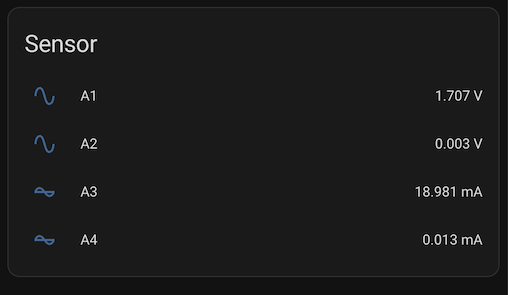

# ADS1115 ADC Sensor (Home Assistant)

Home Assistant custom integration for the Texas Instruments ADS1115 ADC.

## Installation

### Option 1: HACS (Custom Repository)
- Add this repository to HACS as a custom integration.
  - Repository: https://github.com/hzkincony/hass-ads1115
  - Category: Integration
- Install **ADS1115 ADC Sensor** from HACS.
- Restart Home Assistant.

### Option 2: Manual
- Copy `custom_components/ads1115` into your Home Assistant `config/custom_components` directory.
- Restart Home Assistant.

## Configuration Example

Use this configuration from `configuration.yaml`:

```yaml
ads1115:
  - address: 0x48
    i2c_bus: 1

sensor:
  - platform: ads1115
    multiplexer: A0_GND
    gain: 4.096
    name: "A1"
    multiplier: 1.51
  - platform: ads1115
    multiplexer: A1_GND
    gain: 4.096
    name: "A2"
    multiplier: 1.51
  - platform: ads1115
    multiplexer: A2_GND
    gain: 4.096
    name: "A3"
    multiplier: 6.67
    device_class: current
    unit_of_measurement: mA
  - platform: ads1115
    multiplexer: A3_GND
    gain: 4.096
    name: "A4"
    multiplier: 6.67
    device_class: current
    unit_of_measurement: mA
```

## Configuration Fields

### ads1115 (hub)
- **address**: I2C address of the ADS1115. Common values: `0x48` (ADDR->GND, default), `0x49` (ADDR->VDD), `0x4A` (ADDR->SDA), `0x4B` (ADDR->SCL).
- **i2c_bus**: I2C bus number, usually `1` on Raspberry Pi.
- **hub_id** (optional): Custom ID for the hub. Use when you have multiple ADS1115 devices.

### sensor (platform: ads1115)
- **platform**: Must be `ads1115`.
- **multiplexer**: Channel selection.
  - Single-ended: `A0_GND`, `A1_GND`, `A2_GND`, `A3_GND`
  - Differential: `A0_A1`, `A0_A3`, `A1_A3`, `A2_A3`
- **gain**: Voltage range setting (V). Recommended values:
  - `6.144` (±6.144V), `4.096` (±4.096V), `2.048`, `1.024`, `0.512`, `0.256`
- **name**: Friendly name for the entity.
- **multiplier**: Calibration factor (e.g., voltage divider). Range: 0.001–1000.
- **device_class** (optional): Home Assistant device class, e.g., `current`.
- **unit_of_measurement** (optional): Units for display, e.g., `mA`, `V`.
- **state_class** (optional): State class for statistics, e.g., `measurement`.
- **address / i2c_bus / hub_id** (optional): Override hub settings for this sensor.

## Screenshot


